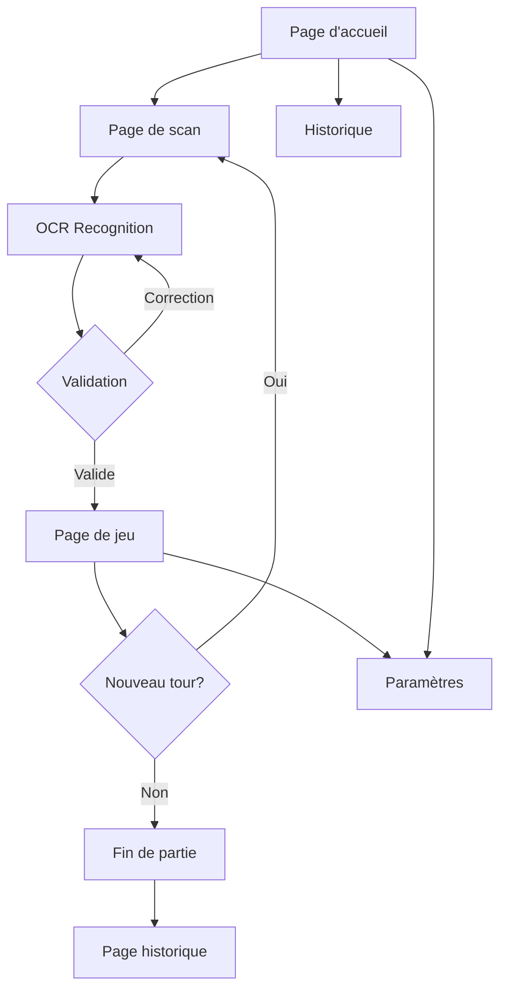

# Neko Party - Product Requirements Document (PRD)

## 1. Product Overview

Neko Party est une application PWA de scan de scores pour le jeu de cartes Skyjo. Elle permet aux joueurs de scanner automatiquement les cartes et de calculer les scores en temps réel grâce à la reconnaissance OCR.

L'application résout le problème du calcul manuel souvent fastidieux et source d'erreurs dans Skyjo. Elle s'adresse aux passionnés de ce jeu de société qui souhaitent moderniser leur expérience de jeu. Avec sa mascotte Neko, l'application offre une expérience ludique et intuitive.

## 2. Core Features

### 2.1 User Roles

| Role   | Registration Method      | Core Permissions                                                    |
| ------ | ------------------------ | ------------------------------------------------------------------- |
| Joueur | No registration required | Scanner des cartes, gérer des parties, consulter l'historique local |
| Invité | Mode anonyme             | Jouer sans sauvegarder l'historique                                 |

### 2.2 Feature Module

L'application Neko Party comprend les pages suivantes :

1. **Page d'accueil** : Bienvenue avec Neko, accès rapide aux fonctionnalités, statistiques rapides
2. **Page de scan** : Caméra/scan d'image, reconnaissance OCR, prévisualisation des résultats
3. **Page de jeu** : Tableau des scores, gestion des joueurs, calcul automatique
4. **Page historique** : Parties précédentes, statistiques, export des données
5. **Page paramètres** : Préférences, tutoriel, à propos

### 2.3 Page Details

| Page Name       | Module Name          | Feature description                                                     |
| --------------- | -------------------- | ----------------------------------------------------------------------- |
| Page d'accueil  | Hero section         | Afficher Neko avec animation de bienvenue, boutons d'action principaux  |
| Page d'accueil  | Statistiques rapides | Afficher nombre total de parties, meilleur score, durée moyenne         |
| Page d'accueil  | Navigation           | Accès rapide aux fonctionnalités principales avec icônes intuitives     |
| Page de scan    | Caméra/Import        | Permettre le scan en direct ou l'import d'image depuis la galerie       |
| Page de scan    | OCR Recognition      | Détecter automatiquement les cartes Skyjo et leurs valeurs numériques   |
| Page de scan    | Validation           | Permettre la correction manuelle des valeurs reconnues avant validation |
| Page de jeu     | Gestion joueurs      | Ajouter/supprimer des joueurs, personnaliser les noms et couleurs       |
| Page de jeu     | Tableau scores       | Afficher le tableau en temps réel avec calcul automatique des totaux    |
| Page de jeu     | Contrôle partie      | Démarrer/arrêter la partie, gestion des tours, sauvegarde automatique   |
| Page historique | Liste parties        | Afficher les parties terminées avec date, durée, participants et scores |
| Page historique | Détails partie       | Voir le détail complet d'une partie avec l'évolution des scores         |
| Page historique | Export données       | Exporter les résultats en JSON ou partager via les applications natives |
| Page paramètres | Préférences          | Choisir le thème, langue, sons, animations de Neko                      |
| Page paramètres | Tutoriel             | Guide interactif pour apprendre à utiliser l'application                |
| Page paramètres | À propos             | Informations sur l'application, version, crédits                        |

## 3. Core Process

### Flow Principal - Nouvelle Partie

1. L'utilisateur arrive sur la page d'accueil et voit Neko l'accueillir
2. Il clique sur "Nouvelle Partie" et accède à la page de scan
3. Il scanne les cartes d'un joueur ou importe une image
4. L'OCR détecte les cartes et affiche les valeurs reconnues
5. L'utilisateur valide ou corrige les valeurs si nécessaire
6. Il passe au joueur suivant jusqu'à ce que tous soient scannés
7. Il accède à la page de jeu avec le tableau des scores
8. Les scores sont calculés automatiquement à chaque tour
9. La partie se termine et est sauvegardée automatiquement
10. L'utilisateur peut consulter l'historique ou commencer une nouvelle partie

### Flow Historique

1. Depuis l'accueil, l'utilisateur accède à l'historique
2. Il voit la liste de ses parties précédentes
3. Il peut filtrer par date ou par joueur
4. Il sélectionne une partie pour voir le détail
5. Il peut exporter ou partager les résultats

## 4. User Interface Design

### 4.1 Design Style (Shadcn UI)

* **Style des boutons** : Arrondis avec ombres portées, effet de survol subtil

* **Police** : Inter ou Poppins, taille 16px pour le corps, 24px pour les titres

* **Layout** : Card-based avec espacement généreux, navigation en bas d'écran

* **Icônes** : Style outlined avec épaisseur 2px, couleurs cohérentes

* **Neko** : Mascotte kawaii style chibi, animations de rebond et clignements d'yeux

### 4.2 Page Design Overview

| Page Name       | Module Name    | UI Elements                                                                           |
| --------------- | -------------- | ------------------------------------------------------------------------------------- |
| Page d'accueil  | Hero section   | Neko centré avec animation idle, boutons "Nouvelle Partie" et "Historique" en dessous |
| Page d'accueil  | Stats          | Cards horizontales avec icônes, chiffres en gras, labels en dessous                   |
| Page de scan    | Zone caméra    | Vue plein écran avec overlay de détection, bouton capture circulaire                  |
| Page de scan    | Résultats OCR  | Liste scrollable des cartes détectées avec preview et champ de correction             |
| Page de jeu     | Tableau scores | Grid responsive avec noms en ligne, scores par colonne, total en bas                  |
| Page historique | Liste          | Cards verticales avec date, durée, avatars des joueurs, score final                   |
| Page paramètres | Menu           | Liste avec icônes à gauche, titres et descriptions, toggles à droite                  |

### 4.3 Responsiveness

* **Desktop-first** avec adaptation mobile

* Breakpoints : 640px (mobile), 768px (tablette), 1024px (desktop)

* Navigation adaptative : bottom bar sur mobile, sidebar sur desktop

* Touch-optimisé : boutons 48px minimum, espacement 8px entre éléments interactifs

* PWA installable avec manifest.json et service worker

### 4.4 Animations et Micro-interactions

* **Neko animations** : Idle bounce (2s), eye blink (aléatoire 3-7s), wave on hover

* **Transitions** : Fade in/out 300ms, slide 400ms avec easing cubic-bezier

* **Feedback** : Haptic feedback sur mobile, sons optionnels (toggle dans paramètres)

* **Loading states** : Skeleton screens, spinner avec Neko, progress bars animées

* **Success states** : Confetti animation, Neko qui applaudit, vibration courte

## 5. Spécifications Non-fonctionnelles

### Performance

* Temps de chargement initial < 3 secondes

* Reconnaissance OCR < 2 secondes par carte

* Réactivité UI < 100ms pour les interactions

* Optimisation des images : compression automatique, lazy loading

### Offline Capability

* Fonctionnalité complète hors ligne grâce à IndexedDB

* Synchronisation automatique quand la connexion est disponible

* Cache strategies : Network first pour l'OCR, Cache first pour l'UI

* Fallback offline : mode manuel complet si OCR indisponible

### Accessibilité

* Support VoiceOver/TalkBack complet

* Contraste WCAG 2.1 AA minimum

* Navigation au clavier complète

* Textes alternatifs pour toutes les images

### Sécurité

* Aucune donnée personnelle collectée

* Stockage local uniquement, pas de cloud

* Permissions minimales (caméra, galerie)

* HTTPS obligatoire pour PWA

## 6. User Stories

### En tant que joueur de Skyjo...

* Je veux scanner rapidement les cartes pour éviter les erreurs de calcul

* Je veux pouvoir jouer hors ligne sans connexion internet

* Je veux voir l'historique de mes parties pour suivre mes progrès

* Je veux pouvoir exporter mes résultats pour les partager

* Je veux une interface intuitive avec Neko qui me guide

### En tant qu'organisateur de soirée jeu...

* Je veux gérer facilement plusieurs joueurs

* Je veux pouvoir corriger les erreurs de scan

* Je veux que l'application soit rapide et fiable

* Je veux pouvoir consulter les règles rapidement

* Je veux que l'application soit amusante pour tous

### En tant que passionné de technologie...

* Je veux une PWA moderne et réactive

* Je veux que l'OCR fonctionne même dans des conditions difficiles

* Je veux des performances optimales

* Je veux une expérience fluide sur tous mes appareils

