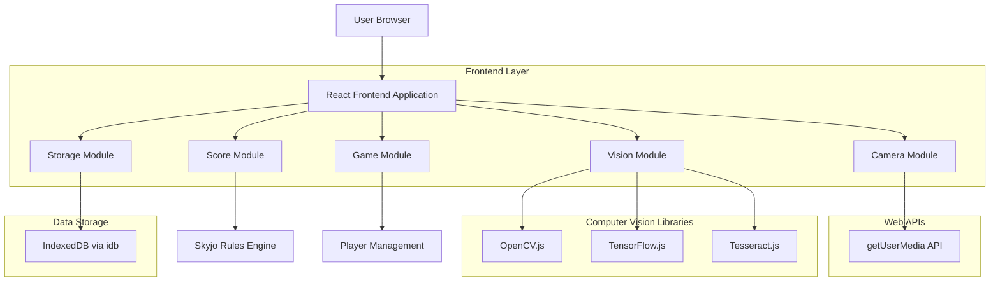
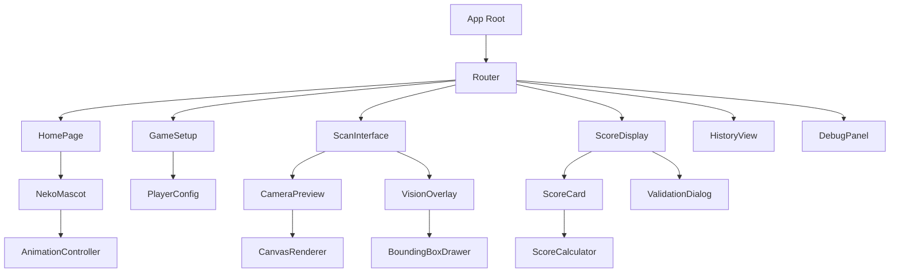
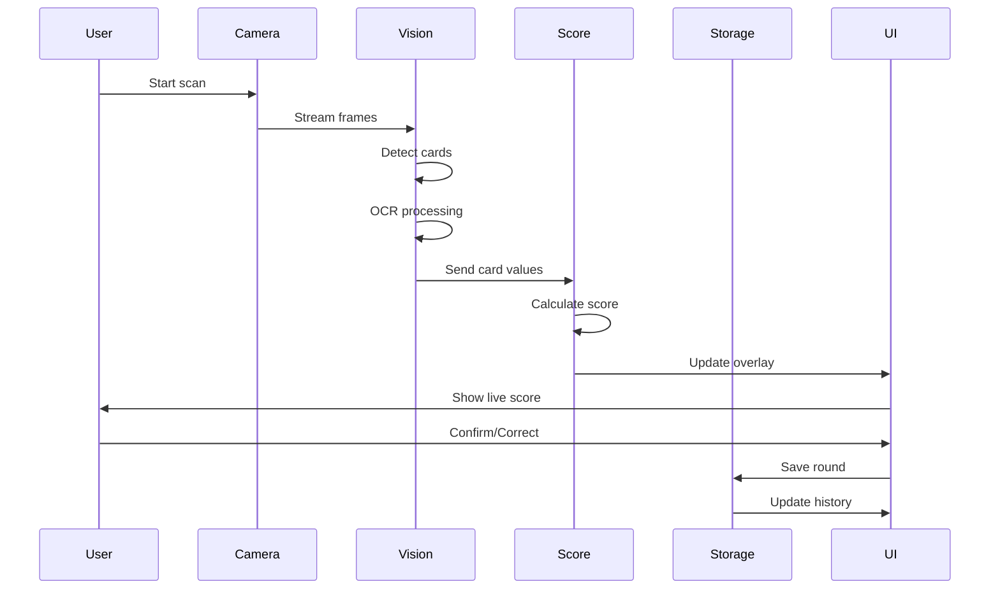

## 1. Architecture design



## 2. Technology Description

- Frontend: React@18 + TypeScript@5 + Vite@5
- UI Framework: Shadcn UI + Tailwind CSS v4
- Computer Vision: OpenCV.js@4 + TensorFlow.js@4 + Tesseract.js@5
- Storage: IndexedDB via idb@8
- Build Tool: Vite-init
- Deployment: Vercel
- Backend: None (100% client-side)

## 3. Route definitions

| Route | Purpose |
|-------|---------|
| / | Home page, welcome with Neko mascot and game selection |
| /game/setup | Player setup, configure 1-8 players with names |
| /game/scan | Camera scanning interface for card detection |
| /game/score | Score display and validation with real-time overlay |
| /game/history | Round history and player statistics |
| /debug | Debug tools and test image gallery |
| /settings | App settings and accessibility options |

## 4. Module Architecture

### 4.1 Core Module Definitions

**Camera Module** (`/modules/camera`)
```typescript
interface CameraStream {
  stream: MediaStream;
  video: HTMLVideoElement;
  canvas: HTMLCanvasElement;
}

interface ScanResult {
  imageData: ImageData;
  timestamp: number;
  orientation: 'portrait' | 'landscape';
}
```

**Vision Module** (`/modules/vision`)
```typescript
interface CardDetection {
  boundingBox: { x: number; y: number; width: number; height: number };
  confidence: number;
  cardPosition: number;
}

interface OCRResult {
  value: number;
  confidence: number;
  isNegative: boolean;
  isUpsideDown: boolean;
}

interface ProcessedCard {
  position: number;
  value: number;
  detection: CardDetection;
  ocr: OCRResult;
}
```

**Score Module** (`/modules/score`)
```typescript
interface SkyjoRules {
  calculateScore(cards: number[]): number;
  validateCombo(cards: number[]): boolean;
  checkSpecialCards(cards: number[]): string[];
}

interface RoundScore {
  playerId: string;
  score: number;
  cards: number[];
  timestamp: number;
}
```

**Game Module** (`/modules/game`)
```typescript
interface Player {
  id: string;
  name: string;
  totalScore: number;
  rounds: RoundScore[];
}

interface GameSession {
  id: string;
  players: Player[];
  currentRound: number;
  createdAt: number;
  updatedAt: number;
}
```

**Storage Module** (`/modules/storage`)
```typescript
interface StorageSchema {
  players: Player[];
  sessions: GameSession[];
  settings: AppSettings;
  debugImages: DebugImage[];
}

interface AppSettings {
  soundEnabled: boolean;
  vibrationEnabled: boolean;
  largeButtons: boolean;
  debugMode: boolean;
}
```

## 5. Component Architecture



## 6. Data Flow Architecture



## 7. Performance Optimizations

### 7.1 Computer Vision Pipeline
- Frame skipping for mobile devices (process every 3rd frame)
- WebWorker for OCR processing to avoid blocking UI
- Canvas pooling to reduce memory allocation
- Progressive enhancement based on device capabilities

### 7.2 Storage Strategy
- Lazy loading of game history
- Image compression for debug captures
- Batch operations for multiple rounds
- IndexedDB transactions with error recovery

### 7.3 UI/UX Optimizations
- Virtual scrolling for large player lists
- Memoized components for score calculations
- Debounced camera adjustments
- Responsive image loading with srcset

## 8. Error Handling & Fallbacks

### 8.1 Camera Errors
```typescript
interface CameraErrorHandler {
  handlePermissionDenied(): void;
  handleNoCamera(): void;
  handleStreamError(): void;
  fallbackToFileUpload(): void;
}
```

### 8.2 Vision Processing Errors
```typescript
interface VisionErrorHandler {
  handleLowConfidence(): void;
  handleOCRFailure(): void;
  handlePerspectiveCorrection(): void;
  manualInputFallback(): void;
}
```

## 9. Security Considerations

- All processing done client-side (no data sent to servers)
- Camera access requires explicit user permission
- Debug images stored locally only
- No external API calls in V1
- CSP headers configured for Vercel deployment

## 10. Future Extensibility

### 10.1 PWA Features (V2)
- Service worker for offline functionality
- App manifest for installation
- Background sync for data persistence
- Push notifications for game events

### 10.2 Multi-Game Support (V2)
- Plugin architecture for game rules
- Configurable card detection models
- Custom scoring algorithms
- Game-specific UI themes

### 10.3 Advanced Vision (V2)
- Custom TensorFlow models
- Real-time multiplayer sync
- Cloud backup (optional)
- Analytics and insights